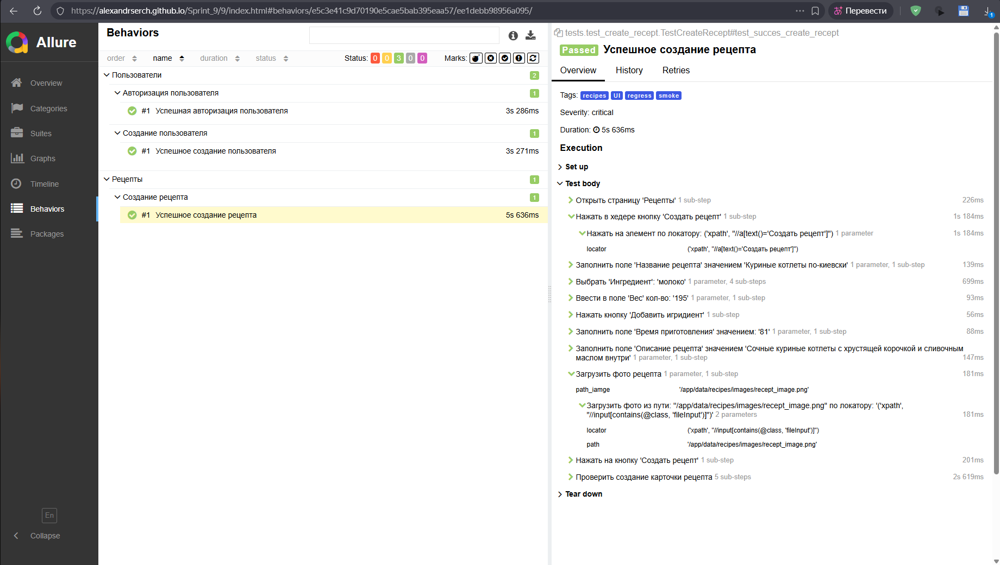

# Sprint 9 — UI-автотесты Foodgram с CI/CD

Проект покрывает UI-сценарии веб-приложения **Foodgram** (сервис рецептов).
Стек: Python · Selenium · Selenoid · pytest · Allure · Docker · GitHub Actions.

---

## Содержание

1. [Технологии](#технологии)
2. [Структура проекта](#структура-проекта)
3. [Тест-кейсы](#тест-кейсы)
4. [Локальный запуск](#локальный-запуск)
5. [CI/CD — GitHub Actions](#cicd--github-actions)
6. [Allure-отчёт на GitHub Pages](#allure-отчёт-на-github-pages)

---

## Технологии

| Инструмент | Назначение |
|---|---|
| Python 3.12 | Язык тестов |
| pytest 9.0 + pytest-xdist | Тест-раннер, параллельный запуск (`-n auto`) |
| Selenium 4 | Управление браузером |
| Selenoid (aerokube) | Удалённый запуск Chrome в Docker |
| Allure pytest | Сбор и генерация отчётов |
| Docker + Compose | Изоляция окружения |
| GitHub Actions | CI/CD пайплайн |
| GitHub Pages | Хостинг Allure-отчётов |
| Faker | Генерация тестовых данных |
| requests | API-вызовы в фикстурах |

---

## Структура проекта

```
Sprint_9/
├── .github/workflows/
│   └── tests.yml            # CI/CD пайплайн
├── config/
│   └── browsers.json        # Конфигурация Selenoid (Chrome 128.0)
├── data/
│   ├── recipes/             # Builder рецептов + тестовое изображение
│   └── users/               # Builder пользователей (Faker ru_RU)
├── helpers/
│   └── api_client.py        # HTTP-клиент (регистрация / авторизация)
├── pages/                   # Page Object Model
│   ├── base_page.py
│   ├── components/
│   │   └── header_component.py
│   ├── login_page.py
│   ├── recept_page.py
│   ├── recipes_page.py
│   └── register_page.py
├── tests/
│   ├── test_create_account.py
│   ├── test_create_recept.py
│   └── test_login_account.py
├── utils/
│   ├── attach.py            # Скриншоты в Allure
│   └── mark.py              # Совмещённый @allure.tag + @pytest.mark
├── conftest.py              # Fixtures: browser, pages, api_client, auth
├── constants.py             # BASE_URL, эндпоинты API
├── docker-compose.yml       # Selenoid + тест-контейнер
├── Dockerfile
├── pytest.ini
└── requirements.txt
```

---

## Тест-кейсы

| Файл | Тест | Маркеры |
|---|---|---|
| `test_create_account.py` | Успешная регистрация пользователя | `UI smoke regress users` |
| `test_login_account.py` | Успешная авторизация | `UI smoke regress users` |
| `test_create_recept.py` | Успешное создание рецепта | `UI smoke regress recipes` |

Доступные маркеры: `All` · `UI` · `smoke` · `regress` · `recipes` · `users`

---

## Локальный запуск

### Требования

- Docker Desktop (запущен)
- Python 3.12+ (опционально, если запускаешь без Docker)

### Запуск через Docker Compose (рекомендуется)

```bash
# 1. Клонировать репозиторий
git clone https://github.com/AlexandrSERCH/Sprint_9.git
cd Sprint_9

# 2. Подтянуть образы Selenoid
docker pull selenoid/vnc_chrome:128.0
docker pull aerokube/video-recorder:latest-release

# 3. Запустить все тесты
docker compose run --rm tests

# 4. Запустить конкретную группу тестов (например, smoke)
docker compose run --rm -e PYTEST_EXTRA_ARGS="-m smoke" tests
```

### Запуск напрямую (без Docker)

```bash
# 1. Создать виртуальное окружение
python -m venv .venv
source .venv/bin/activate  # Windows: .venv\Scripts\activate

# 2. Установить зависимости
pip install -r requirements.txt

# 3. Запустить тесты (Selenoid должен быть доступен на localhost:4444)
pytest --alluredir=allure-result

# 4. Сгенерировать и открыть отчёт
allure serve allure-result
```

### Запуск по маркеру

```bash
# Только smoke-тесты
pytest -m smoke --alluredir=allure-result

# Только тесты рецептов
pytest -m recipes --alluredir=allure-result
```

---

## CI/CD — GitHub Actions

Конфигурация: `.github/workflows/tests.yml`

### Автоматический запуск — при push в `develop`

Каждый коммит в ветку `develop` запускает полный прогон тестов.

```
push → develop
  └── Checkout
  └── Setup Docker Buildx
  └── Pull Selenoid images (Chrome 128.0 + video-recorder)
  └── Build test image
  └── Run tests (docker compose run)
  └── Upload Allure results (артефакт, 7 дней)
  └── Upload Selenoid video (артефакт, 3 дня)
  └── Download Allure history (из gh-pages)
  └── Generate Allure report (с историей)
  └── Publish to GitHub Pages (ветка gh-pages)
  └── Print report URL
  └── Tear down (docker compose down -v)
```

### Ручной запуск — workflow_dispatch

Перейти в репозиторий → **Actions** → **Run Tests** → **Run workflow**.

Доступен выбор группы тестов:

| Значение | Что запускается |
|---|---|
| `All` (по умолчанию) | Все тесты |
| `UI` | Все UI-тесты |
| `smoke` | Smoke-тесты |
| `regress` | Regress-тесты |
| `recipes` | Тесты рецептов |
| `users` | Тесты пользователей |


---

## Allure-отчёт на GitHub Pages

После каждого запуска (автоматического или ручного) отчёт публикуется по адресу:

```
https://AlexandrSERCH.github.io/Sprint_9/{run_number}/
```

Каждый запуск создаёт собственную директорию с номером запуска — история отчётов сохраняется.
Ветка `gh-pages` содержит все исторические отчёты в `allure-history/`.
Актуальный отчёт доступен по прямой ссылке из лога шага **Print report URL** в GitHub Actions.

